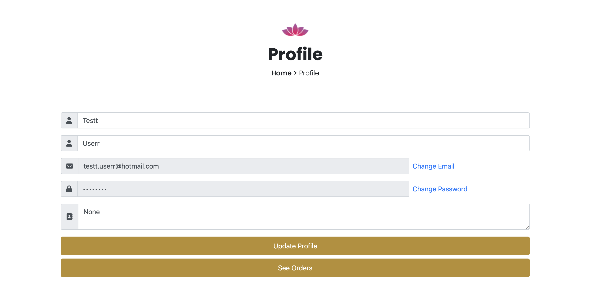
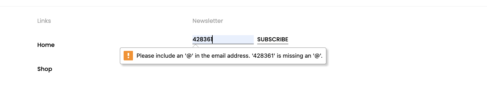
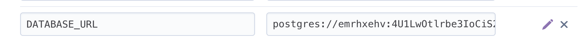

# Lotus Aura Natural 
Lotus Aura Natural is an e-commerce website that aims to reach interested people who care about natural stones, spiritual items and energy, and allows these people to access up-to-date information and purchase the products they want.
This is a fictional project that will most likely never be released to the masses. This site was created for Portfolio Project #5 (E-Commerce Applications Portfolio Project), Diploma in Full Stack Software Development at [Code Institute.](https://codeinstitute.net/se/)

[View live website here](https://lotus-project-433bebe152ef.herokuapp.com/)
 

## Table of Content

- [Lotus Aura Natural](#lotus-aura-natural)
  - [Table of Content](#table-of-content)
  - [Project](#project)
  - [Objective](#objective)
  - [Site Users Goal](#site-users-goal)
  - [Site Owners Goal](#site-owners-goal)
    - [Business Model](#business-model)
    - [Marketing Techniques](#marketing-techniques)
  - [Project Management](#project-management)
    - [Github Board](#github-board)
    - [Database Schema](#database-schema)
  - [User Experience (UX)](#user-experience-ux)
    - [Wireframes](#wireframes)
    - [User Stories](#user-stories)
    - [Site User](#site-user)
    - [Viewing And Navigation](#viewing-and-navigation)
      - [As a Customer](#as-a-customer)
      - [As a Site User](#as-a-site-user)
    - [Registration And User Accounts](#registration-and-user-accounts)
      - [As a Site User](#as-a-site-user-1)
    - [Sorting And Searching](#sorting-and-searching)
      - [As a Customer](#as-a-customer-1)
    - [Purchasing And Checkout](#purchasing-and-checkout)
      - [As a Customer](#as-a-customer-2)
      - [Site Admin](#site-admin)
    - [Site Structure](#site-structure)
    - [Design Choices](#design-choices)
- [Features](#features)
  - [Existing Features](#existing-features)
    - [Navigation](#navigation)
      - [Navigation - User Not Logged In](#navigation---user-not-logged-in)
      - [Navigation - User Logged In](#navigation---user-logged-in)
    - [Home](#home)
      - [Home Page Top Area](#home-page-top-area)
      - [Home Page Blog Area](#home-page-blog-area)
      - [Blog Detail](#blog-detail)
      - [Blog - View All Blog Posts](#blog---view-all-blog-posts)
    - [Products](#products)
      - [Product Detail](#product-detail)
      - [Product Detail - Added To Wishlist](#product-detail---added-to-wishlist)
      - [Select Quantity of Product](#select-quantity-of-product)
    - [Shopping Bag](#shopping-bag)
    - [Secure Checkout](#secure-checkout)
    - [Order Confirmation](#order-confirmation)
  - [Confirmation Email](#confirmation-email)
    - [Sign Up](#sign-up)
    - [Sign In](#sign-in)
    - [Password Reset](#password-reset)
    - [Sign Out](#sign-out)
    - [Footer](#footer)
    - [Visual Feedback To The User](#visual-feedback-to-the-user)
    - [Features Left to Implement](#features-left-to-implement)
  - [Technologies Used](#technologies-used)
    - [Languages](#languages)
    - [Frameworks \& Software](#frameworks--software)
    - [Libraries                        !!!!!!! kontrol et hepsini !!!!!!!!](#libraries-------------------------kontrol-et-hepsini-)
  - [Testing](#testing)
    - [Testing User Stories](#testing-user-stories)
      - [Viewing And Navigation](#viewing-and-navigation-1)
      - [Registration And User Accounts](#registration-and-user-accounts-1)
      - [Sorting And Searching](#sorting-and-searching-1)
      - [Purchasing And Checkout](#purchasing-and-checkout-1)
      - [Site Admin](#site-admin-1)
    - [Code Validation](#code-validation)
      - [Markup Validation](#markup-validation)
      - [CSS Validation](#css-validation)
      - [PEP Validation](#pep-validation)
      - [Javascript Validation                  !!!!!!!!!!!!!](#javascript-validation------------------)
    - [Additional Testing](#additional-testing)
      - [Manual Testing](#manual-testing)
      - [Automated Testing](#automated-testing)
      - [Responsiveness Test](#responsiveness-test)
      - [Browser Compability](#browser-compability)
      - [Lighthouse](#lighthouse)
    - [Known Bugs](#known-bugs)
  - [Deployment](#deployment)
    - [Deployment to Heroku](#deployment-to-heroku)
  - [How To Fork The Repository On GitHub](#how-to-fork-the-repository-on-github)
  - [Cloning And Setting Up This Project](#cloning-and-setting-up-this-project)
  - [Credits](#credits)
  - [Technical](#technical)
  - [Acknowledgements](#acknowledgements)

## Project

## Objective

Lotus Aura Natural is an e-commerce site that aims to supply and deliver natural stones and other natural supporting products to people, as well as products that help support and clean people's aura energies and environmental energies.  I have decided to create a site as authentic I can and at the same time demonstrate my knowledge within the Django Framework, Python, JavaScript, CSS and HTML. It invites users to:

  * View the store as Guests
  * Register for an Account
  * Use the stores Wishlist feature to record liked products
  * Browse products by category and price
  * View, add and edit products in their bag
  * As registered users, view past orders
  * Subscribe and get new content.
  
### Stripe Dummy Card Details
If you wish to make a test purchase, you can use the following Stripe Dummy Card details:

Success Card Number: 4242424242424242

Required Authentication: 4000002500003155

Declined Card Number: 4000000000009995

Exp Date: Any date in the future using the format MM/YY

CVN: any 3 digit number

Any payments made using a valid debit/credit card will not be processed and the card will not be charged. No orders made will be fulfilled.

For full Admin access to Django Admin panel with relevant sign-in credentials: [Lotus Django - Admin](https://lotus-project-433bebe152ef.herokuapp.com/admin/login/?next=/admin/)

For access to Admin Dashboard frontend view with relevant sign-in credentials: [Lotus Admin Dashboard](https://lotus-project-433bebe152ef.herokuapp.com/auth/login/)
If you want to login as super user, you should login as super user(admin) on login section.

## Site Users Goal

Customers are provided with an easy, intuitive shopping experience and encouraged to benefit from sustainable, environmentally friendly products. It is hoped that customers will register/register for an account as they should be able to enjoy all user features. A sense of community is created with a weekly newsletter that will inform customers about new products, trends and needed articles.  

## Site Owners Goal

Admins can easily access the site from the admin panel and make any adjustments they wish. To introduce natural products to users and to provide them with explanations where they can get the necessary information about them, thus informing users and encouraging them to include these products in their lives. We encourage our users to subscribe to our articles on our blog page, where we regularly add new information, thus making them our customers by staying in constant communication.

### Business Model

To know which business model that fits the needs and requirements for a business is of course very important. Lotus Aura Natural is a business that sells the products directly to the end users through direct selling via the Lotus Aura Natural webpage. The buyers are private consumers which makes Lotus Aura Natural business model a B2C (Business To Consumer)-model. This means that everytime a Lotus Aura Natural customer buys something from the webpage a B2C transaction is completed. To be able to implement a B2C eCommerce model in a successful way it is very important to have a quickly adjustable platform to be able to adapt to the customers if needed. The Lotus Aura Natural webpage is a highly adjustable platform which makes fast adjustments quite easy. But to have a solid platform is not everything, of course there is a need for good marketing techniques to be able to reach out to new customers and engage the existing ones.

### Marketing Techniques

There are a lot of different marketing techniques out there. For Lotus Aura Natural there has from the start been some areas that builds the foundation of the Lotus Aura Natural trademark, and also sets the prerequisites to reach the customers.
  * Optimize For Mobile Devices
  
In a world where most of the people visits the web from a mobile device it is very important that the site looks good on mobiles and tablets. The Lotus Aura Natural site is fully responsive which means that it takes into account whether the customer uses a mobile or desktop device.

  * The Website Layout
  
The Lotus Aura Natural website is easy to navigate and have an intuitive design which makes it easy for the customer to find relevant information and make a purchase without a hassle.

  * Create content (content marketing)
  
On the Lotus Aura Natural site there is a blog that is being used to create original, informative and relevant content to the Lotus Aura Natural customers.
Brief information about the products and how to use them is also provided and this will guide the user. Lotus Aura Naturals ambition is that the customers want to visit our site because they want to not because we want to.

  * Facebook (social media marketing)
  
Social Media marketing is a great tool if it's done in the right way. Lotus Aura Natural has a presence on social media through the platforms Facebook and Instagram. It helps Lotus Aura Natural to communicate with both existing customers but also potential new ones. Through the social media platforms Lotus Aura Natural can create engagement, interact on a broad level and maintain brand recognition. For Lotus Aura Natural the product sale is being made on the site why it is very important to use the social media platforms to boost traffic to the website (i.e. when a new blog has been published). For now Lotus Aura Natural only focuses on organic growth but will most likely start with payed ads to target specific customer groups in the future.

* Lotus Aura Natural - Facebook
  
  
  
   [Lotus Aura Natural Facebook  Page Link](https://www.facebook.com/share/WuToGyaF3BRaTbZq/?mibextid=LQQJ4d)
  
  
  * E-mail marketing One form of reaching out to the customers in an effective way is through e-mail marketing. But in a world with a lot of challenges with spam it is very important to think about the content and who is being targeted. Lotus Aura Natural gives the site users / customers a possibility to sign up for a Lotus Aura Natural newsletter on the Lotus Aura Natural site. The service being used is [Mailchimp](https://mailchimp.com/?currency=SEK) and is an easy way to let the customers know what is happening at Lotus Aura Natural. The content being sent out is personal and can include i.e. advertisment for new blog posts, product of the month, events, co-operations, and discount codes).
  
  * Search Engine Optimization (SEO) Search Engine Optimization is a very important method to improve the ranking on search-engines (and has a high Return Of Investement if done right). The ambition is that Lotus Aura Natural includes relevant, professional and reliable content and offers a hassle free experience for the site user. Lotus Aura Natural has an ambition (even thought it's not an easy task) to use keywords in the content that matches the users search criterias when using search engines. Descriptive Meta Tags have been implemented on the site after a brainstorming session. The final description / words that have been used can be seen below:
  
    * Meta Description - Lotus Aura Natural is a small company, e-shop and store of spiritual energy and natural stones located in the south of Sweden.
    * Meta Keywords - lotus aura natural, spiritual energy, positive energy, natural stones, chakra, e-shop, chakra balance, incense, stone, bracelet, wall accessory, chakra stones, sweden
  
The site also includes a sitemap.xml and robots.txt to make sure that the search engines can find and crawl the pages on the site. 

## Project Management

### Github Board

In order to develop my project in a planned manner and keep it organized, I used the project section of github and gave importance to user experiences by creating user stories while planning the work to be done.[Github Board](https://github.com/users/mervecoskunn/projects/9)

### Database Schema

!!!!! Add database schemaaa!!!!!

## User Experience (UX)

### Wireframes

I preferred to design the project with [Figma.](https://www.figma.com/login) Because it allowed us to visually see what we would encounter at the end of project development and to prevent possible bad user experiences.
Responsive design was preferred in the design and separate designs were made for each screen sizes.

First, the design started with the first draft that would also meet the project requirements and provided an overview of the project.

- Large Screen Figma Design

  

- Tablet Screen Figma Design
  
  

- Mobile Size Figma Design
  
  

I would like to point out that some additions and changes were made to the design during the project development process. Although the design is generally adhered to, some additions have been made. 

### User Stories

Below the user stories for the project are listed to clarify why particular feature matters. These will then be tested and confirmed in the Testing section.

### Site User

### Viewing And Navigation 

#### As a Customer

* I want to view a list of products so that I can read more about it and purchase it
* I want to click on a specific product so that I view its details like price, description, product rating and image
* I want to read the posts that are connected to a specific product so that I can base my purchase decision on that
* I want to view the total of my purchases at any time so that I can keep track of my expenses
* I want to like and unlike a review on a product I have purchased so that it is possible for me to raise my opinion

#### As a Site User

* I want to navigate easy on the site through paginated list of products and posts so that I feel comfortable using the site
* I want to view the site owners blog post so that I can get the latest information
* I want to contact Lotus Aura Natural in an easy way so that I can interact with them if I have a need for it
* I want to get visual feedback when interacting with the content so that I can be sure how I have interacted with the page

### Registration And User Accounts

#### As a Site User

* I want to register an account so that I have a personal account and get access to my profile
* I want to have my own user profile so that I can view my personal order history, write reviews and update my contact / payment information
* I want to log out from the site so that I can feel safe that nobody can access my information

### Sorting And Searching

#### As a Customer

* I want to sort the list of all products in different ways so that I can identify the name, low-high prices and products based on category
* I want to sort a specific category of products so that I can identify filter or just sort the products by name.
* I want to easily get information about what I have searched for and how many results the search generated so that I can see if the product is available.

### Purchasing And Checkout

#### As a Customer

* I want to easily choose the quantity of a product when purchasing it so that I ensure I get the correct product
* I want to be able to easily view the items to purchase in my cart to see the total cost and all the items I am about to purchase.
* I want to easily adjust the amount of products in my cart so that I can change the cart before checking out
* I want to give my payment information in an easy way so that the checkout-process is quick and easy
* I want to feel safe and secure when interacting with the site so that I feel comfortable to provide all necessary information needed for purchase
* I want to view an order confirmation after checkout so that I can secure I have purchased the correct items and everything is ok
* I want to receive an email confirmation after the checkout process is done so that I can keep the information for future use if needed
* I want to receive an email confirmation when my order changes so that I get relevant information about my order
* I want to create a wishlist so that I can come back later to purchase the products

#### Site Admin

* I want to search create, update and delete product posts so that I can manage my product content
* I want to log out from the site so that I can feel safe that nobody can access my information
* I want to create draft product posts so that I can finish writing the content later
* I want to access an admin area so that I can get a general understanding of i.e. number of users, number of products
* I want to get visual feedback when interacting with the content so that I can be sure how I have interacted with the page
* I want to create, update and delete blog posts so that I can manage my blog content
* I want to create draft blog posts so that I can finish writing the content later.
  
### Site Structure

The Lotus Aura Natural Site can be used in a logged in and logged out mode. Depending on the login status different pages are available for the user. When the user is logged out the pages home, products, categories, special offers, my account (register and login) are available. When the user is logged in my profile, my wishlist and logout also is available. If you are logged in as an administrator manage blog and manage products is available as well. Worth mentioning is that the site has a clean, intuitive, and minimalistic design that makes the site visit a nice experience.

Read more about the different pages in the [Features](#Features) section.

### Design Choices

 * Color Schema

In this e-commerce site, plain colors have been used in order to keep the information and products to be presented to the customer as simple and user-oriented as possible. The colors and codes used throughout the site construction are as follows.

 * Typography
  
The fonts used for the site are poppins because of I wanted to create very simply and usefuly and clear webpage. 
 * I used poppins , 'sans-serif' font family for this project
 * I used different font-weights for this project and they are 300, 400,500,600,700
 * 
 

# Features

The features of the site are listed below.
 
## Existing Features

### Navigation

The navigation bar includes the same basic options for the user (logged in or not logged in). If the user is logged in or logged in as an administrator the sub-menus look different.

#### Navigation - User Not Logged In
 * Home - It takes you to an overview page and allows the user to obtain general information about the site.
 * Shop - This is the page where the products are listed and where the user can list the products according to their preferences according to filters.
 * Contact - The user displays a form to contact the company and can communicate by filling out and sending the form. 
 * Search Box - The user can search, list and view the product by typing the name or other features of the product user is looking for.
 * My Account - The user can enter the site through a menu that opens to log in or register.
 * Favorites - The user can click to favorites icon and user can see added products to own favorites page.
 * Cart - The user can see cart icon on navigation so that user can click it for to own go cart page.
 * * Login - The user can click to login section so user can register or login so that user can buy something or add product to favorites page.
  

#### Navigation - User Logged In

When an ordinary user is logged in the my account gets more available options, my profile and my favorites.

 * My Profile - On the profile page the user can change delivery information and see the order history (and confirmations from earlier purchases)
  
 * My Favorites - On the favorites page the user can find their favorite products that is populated when the user adds items to the favorites from the product detail area. From this view the user also can remove products from the favorites. Or user can add to cart from favorites products and choose quantity.
   
 * User Register Page
   
   

 * User Register Success
   
   User will see one flash message register success.

 * If user try to register again, user will see an information "e-mail already exist". User should try to login page.

    
   
 * User Login Page
   
   
   
 * Navigation my account- User Logged In

    
   
 * Profile page for login user 

   

  * User can update own personal information on this page and change e-mail and change password
    
  * Change e-mail
    
    
    
    
    
    
    
    
    
  * Change password
    
    
    
    
    
    
    
    
    
    

 * Navigation - My Profile - Order list Empty
  
  

 * Navigation - My Profile - with status with order list

  
   
 * Navigation - My Account- My Favorites
   
 * User can see empty favorites page when click to navigation bar heart icon 
   
   

 
 *  User can add a product to favorites page  
   

 * User can remove products from favorites page 
   
   

 * User can add to cart products from favorites page to cart page and user can select also quantity for the add to cart page  
   
   

  * User can click on the navigation bar to logout section and so that user can logout successfully.

    

 * Navigation - Admin Logged In 
  
   * When a superuser / administrator is logged in the my account gets more avilable options, manage products and manage blog
     
    
  
 * Navigation - My Account - Admin Logged In
   
   * Admin can use different features on navigation bar when login.
   * Admin can click profile icon on the navbar and manage website and own information.
   * Admin can manage products edit products, delete products, add products, search and read all about web site.
   * Admin can manage blog posts edit posts,delete, read, add blog post
   * Admin can see all orders.
   * Admin can see own order list alson on this page.
   * Admin can update  own profile information as other user.
   
   * Navigation - Admin Logged In - Product Management- Admin can click to manage product button and go product page for admin.This page is different than other normal users of product page. Admin has edit delete add products buttons on this page so that admin can manage products.
   
    
   
 * Navigation - Admin Logged In - Product Management - Edit
   
    
   
 * Navigation - Admin Logged In - Product Management - Delete
   
    

    
   
 * Navigation - Admin Logged In - Product Management - Add products
   
   
   
 * Navigation - Admin Logged In - Product Management - Read Detail
  
   
   
   * Manage Blog - Admin can click to manage blog posts button and go blog page for admin.This page is different than other normal users of blog page. Admin has edit delete add  buttons on this page so that admin can manage blog posts.
    
 * Navigation - Admin Logged In - Blog Management - Edit
   
    
   
* Navigation - Admin Logged In - Blog Management - Delete
  
    
  
 * Navigation - Admin Logged In - Blog Management - Add
   
    
   
 * Navigation - Admin Logged In - Blog Management - list all blog posts and read  of select one post. Admin can click the read more button and read one post.
    
    
     
### Home

#### Home Page Top Area

There are buttons on the home page that direct you to start shopping or to subscribe to be informed about blog posts, and apart from that, there are a few of the posts shared on the blog page, and the user can click on the read more button to read more details, or if he wishes, he can click on the button that goes to the blog page to go to the blog page where he can see all the posts can go.

#### Home Page Blog Area

Blog Area - The blog area shows several blog posts. Above the posts there is a button that directs the user to a specific page where all the posts are listed. When a site user clicks on the blog post, a blog detail view is shown. If the administrator is logged in, there is the possibility to go to the edit blog administration page from the blog area and blog detail view (via the edit button).

#### Blog Detail

#### Blog - View All Blog Posts

We list all the posts shared on the blog page and we can click on the post we want to see in more detail and go to the detail page.

#### Contact Page

If user want to contact and send a message to lotus team, user can click the contact on navbar or footer contact link and so that can write a message and send to lotus team and lotus team e-mail adress (lotusauranaturall@gmail.com) take a new mail from message sender.

### Products

Listing of products will vary depending on the selected filter and sort by. When we first enter the shop page, the products are listed as mixed.

#### Product Detail

User can click one selected product and go to directly product detail page.

User can click the filter section on shop page and select categories and list  products of each category on page.

User can click the filter section on shop page and select categories and list  products of each category on page.

### Search Product

User can use also search section on the top of the page(product page and home page) and so that user can search specific product and find it easly. But if user write a wrong name or a product that is not available on this website, user will see a message "Nothing Found". If user want to contunie shopping, user can click the button "Continue Shopping" or write another keyword to seach section for find another product.

#### Product Detail - Add To Favorite or Cart

User can select one product and if user wish to add this product to favorite, user should click the button name of add to favorite on product detail page.

User can select one product and if user wish to add this product to cart, user should click the button name of add to cart on product detail page.And user can select also quantity of products for add to cart on product detail page.

####  Select Quantity of Product

When adding products to the cart, the user can choose how many items to add.
User can then edit the number of products user chooses and increase or decrease them.

### Cart Page

When the site user had added products by pressing the add to bag button the products are being stored in the shopping bag that can be accessed via the 'cart'-button in the navigation menu. In the shopping bag area the user can update and delete the products they have added and get an understandig about the total cost for the products incl. and excl. delivery cost. From this view the user can either continue to shop or go to the secure checkout page.

* If user click to button name of Add to cart so that user will see one flash message.

* User can see own cart page with added products

### Secure Checkout

### Order Confirmation

If everything goes according to plan and the webhooks between Stripe and the site are OK an order confirmation page will be shown to the user (and a confirmation e-mail will be sent to the users registered e-mail address).
  

## Confirmation Email

When the order is confirmed the user gets an confirmation e-mail to the registered e-mail.

* User can list own order on profile page
  
  
  
*  User can see order status and information about order
  
  

### Sign Up

On this page the user can sign in to Lotus Aura Natural.

### Sign In 

### Password Reset

If the user has forgotten the password they can ask for a password reset through this page.

### Sign Out

When the user clicks sign out in the menu bar a confirmation page is being showed so that the user don't accidently sign out.

### Footer

* Home Page -  User can click the home link and go to home page.
* Shop Page -  User can click the shop link and go to shop page and  see mix list of products.  
* Blog Page -  User can click the blog link and go to blog page and see blog posts.
* Privacy Policy - User can click the privacy policy link an go to privacy page and see rules about Lotus Aura Natural.
* Contact Page - User can click the contact link and go to contact page.
* FAQ - User can click the FAQ link and go to FAQ page and read the popular questions and their answers.
* Newsletter - User can write own real email and subscripe for get information when lotus team add new blog post.
* Social Media icons -  User can click the facebook icon and see lotus aura natural facebook page.
* Instagram - If user want to go instagram dashboard click the instagram icon for now Lotus Aura Natural does not have instagram page for marketing.
* Youtube - If user want to go youtube dashboard click the youtube icon for now Lotus Aura Natural does not have youtube page for marketing.
  
  
  

* Privacy Policy - User can click the Privacy Policy link and go to hprivacy policy page and get information about site owner and sites' privacy policies.
  
  

* Subscribe section - User can write own e mail and subcsribe sites newsletters and get information all about site.
  
  

  
  

* When a new blog is added to the blog page, an informative e-mail is sent to those who subscribe, and in this way, those who subscribe are provided with new and up-to-date information.

 

### 404 Error Page

Our application features a custom 404 error page that appears when users attempt to access a non-existent page. This page is designed to inform users and redirect them to the homepage or other important sections of the site. The purpose of the 404 error page is to improve user experience and help lost visitors find their way back.

   
   
### 500 Error Page

Our application includes a custom 500 error page that is displayed when the server encounters an internal error. This page informs users that something has gone wrong on our end and provides them with options to return to the homepage or contact support. The goal of the 500 error page is to enhance user experience by providing clear communication and guidance when unexpected issues occur.   
   
### Visual Feedback To The User

The sites incorporates flash messages when an action has been performed (i.e. delete/update/add to bag-actions). Examples of this in the screenshots below.

  * 
    
  * 
   
  * 
    
  * 
    
  * 
   
  * 
   
  * 
   
  * 

    

### Features Left to Implement

* Give the logged in site user the possibility to add a promotion code
* Give the logged in site user the possibility to rate a product
* Give the logged in site user the possibility to write a product review
* Give the logged in site user the ability to add comments and likes to posts on the blog page
* Add an admin area with general information (like number of logged in users, number of products and so on)
* Add more e-mail functionality (i.e email is being sent out when the order has been handled)
* Add more visual feedback to the user

## Technologies Used

### Languages
 * [Python](https://www.python.org/) - Provides the functionallty for the site.
 * [HTML5](https://en.wikipedia.org/wiki/HTML) - Provides the content and structure for the website.
 * [CSS3](https://en.wikipedia.org/wiki/CSS) - Provides the styling for the website.
 * [Javascript](https://en.wikipedia.org/wiki/JavaScript) - Provides interactive elements of the website.

### Frameworks & Software
 * [Bootstrap 5](https://getbootstrap.com/) - A CSS framework that helps building solid, responsive, mobile-first sites
 * [Django](https://www.djangoproject.com/) - A model-view-template framework used to create the Review | Alliance site
 * [Figma](https://www.figma.com/login) - Used to create the wireframe.
 * [Github](https://github.com/) - Used to host and edit the website.
 * [Heroku](https://www.heroku.com/home) - A cloud platform that the application is deployed to.
 * [Lighthouse](https://developer.chrome.com/docs/lighthouse/overview/) - Used to test performance of site.
 * [Responsive Design Checker](https://www.responsivedesignchecker.com/) - Used for responsiveness check.
 * [Graph Models](https://django-extensions.readthedocs.io/en/latest/graph_models.html) - Used to create a *.dot file of all models in the project.
 * [Favicon](https://favicon.io/) - Used to create the favicon.
 * [Freepik](https://www.freepik.com/)- Used to find logo
 * [VSCode](https://code.visualstudio.com/) - Used to create and edit the site.
 * [Google Chrome DevTools](https://developer.chrome.com/docs/devtools/) - Used to debug and test responsiveness.
 * [Github Board](https://github.com/users/mervecoskunn/projects/9) - A project management tool to organize the project.
 * [Mailchimp](https://mailchimp.com/?currency=SEK) - Used for the newsletter functionality on the site.
 * [Amazon Web Service](https://aws.amazon.com/) - A service that hosts all static files and images in the project.
 * [HTML Validation](https://validator.w3.org/) - Used to validate HTML code
 * [CSS Validation](https://jigsaw.w3.org/css-validator/) - Used to validate CSS code
 * [CI Python Linter](https://pep8ci.herokuapp.com/) - Used to lint the Python code in the project
 * [JSHint Validation](https://jshint.com/) - Used to validate JavaScript code

### Libraries                        

The libraries used in this project are located in the requirements.txt file and have been documented below

* [asgiref](https://pypi.org/project/asgiref/) - ASGI is a standard for Python asynchronous web apps and servers to communicate with each other, and positioned as an asynchronous successor to WSGI.

* [backports.zoneinfo](https://pypi.org/project/backports.zoneinfo/) - Exposes the backports.zoneinfo module, which is a backport of the zoneinfo module.

* [boto3](https://boto3.amazonaws.com/v1/documentation/api/latest/index.html) - Is used to create, configure, and manage AWS services, such as Amazon Elastic Compute Cloud (Amazon EC2) and Amazon Simple Storage Service (Amazon S3).

* [botocore](https://botocore.amazonaws.com/v1/documentation/api/latest/index.html) - Botocore is a low-level interface to a growing number of Amazon Web Services. Botocore serves as the foundation for the AWS-CLI command line utilities.

* [dj-database-url](https://pypi.org/project/dj-database-url/) - This simple Django utility allows you to utilize the 12factor inspired DATABASE_URL environment variable to configure your Django application.)

* [Django](https://pypi.org/project/Django/) - Django is a high-level Python web framework that encourages rapid development and clean, pragmatic design.

* [django-allauth](https://pypi.org/project/django-allauth/) - Integrated set of Django applications addressing authentication, registration, account management as well as 3rd party (social) account authentication.

* [django-countries](https://pypi.org/project/django-countries/)- A Django application that provides country choices for use with forms, flag icons static files, and a country field for models.)

* [django-crispy-forms](https://pypi.org/project/django-crispy-forms/) - Used to integrate Django DRY forms in the project.

* [django-extensions](https://pypi.org/project/django-extensions/) - Django Extensions is a collection of custom extensions for the Django Framework.

* [django-storages](https://django-storages.readthedocs.io/en/latest/) - django-storages is a collection of custom storage backends for Django.

* [gunicorn](https://pypi.org/project/gunicorn/) - Gunicorn ‘Green Unicorn’ is a Python WSGI HTTP Server for UNIX. It’s a pre-fork worker model ported from Ruby’s Unicorn project. The Gunicorn server is broadly compatible with various web frameworks, simply implemented, light on server resource usage, and fairly speedy.

* [jmespath](https://pypi.org/project/jmespath/) - JMESPath (pronounced “james path”) allows you to declaratively specify how to extract elements from a JSON document.

* [oauthlib](https://pypi.org/project/oauthlib/) - OAuthLib is a framework which implements the logic of OAuth1 or OAuth2 without assuming a specific HTTP request object or web framework.

* [Pillow](https://pypi.org/project/pillow/) - The Python Imaging Library adds image processing capabilities to your Python interpreter.

* [psycopg2](https://pypi.org/project/psycopg2/) - Psycopg is the most popular PostgreSQL database adapter for the Python programming language.

* [pydot](https://pypi.org/project/pydot/) - is an interface to Graphviz that can parse and dump into the DOT laungage.

* [PyJWT](https://pypi.org/project/PyJWT/) - A Python implementation of RFC 7519.

* [python3-openid](https://pypi.org/project/python3-openid/) - OpenID support for modern servers and consumers.

* [pytz](https://pypi.org/project/python3-openid/) - This is a set of Python packages to support use of the OpenID decentralized identity system in your application, update to Python 3

* [requests-oauhlib](https://pypi.org/project/requests-oauthlib/) - P rovides first-class OAuth library support for Requests.

* [s3transfer](https://pypi.org/project/s3transfer/)- S3transfer is a Python library for managing Amazon S3 transfers. This project is maintained and published by Amazon Web Services.

* [sqlparse](https://pypi.org/project/sqlparse/)- sqlparse is a non-validating SQL parser for Python. It provides support for parsing, splitting and formatting SQL statements.

* [stripe](https://pypi.org/project/stripe/) - A Python library for Stripe’s API.

 
## Testing

### Testing User Stories

#### Viewing And Navigation

* As a Customer I want to view a list of products so that I can read more about it and purchase it
  * At the top of the site there is a navigation bar with links that lists products based on categories(filter), sorting or through a search query.
* As a Customer I want to click on a specific product so that I view its details like price, description, product rating and image 
  * At the top of the site there is a navigation bar with links that lists products based on shop , user can filter which one category products list and  sorting or through a search query. When a user clicks on a product a detail view of the product opens. 
* As a Customer I want to click on a specific product so that I view its details like price, description, product rating and image
  * At the top of the site there is a navigation bar with links that lists products based on categories, sorting or through a search query. When a user clicks on a product a detail view of the product opens.
* As a Customer I want to read the reviews that are connected to a specific product so that I can base my purchase decision on that
  * Not implemented yet
* As a Customer I want to view the total of my purchases at any time so that I can keep track of my expenses
  * At the top of the screen the user can see the cart icon. The user can  click the cart icon to open the shopping bag page where the totals of the purchases also can be viewed.
* As a Site User I want to navigate easy on the site through paginated list of products and posts so that I feel comfortable using the site
  * On the blog posts in the home page the pagination is activated when there are more than six posts. On the product pages the pagination is activated when there are more than six products.
* As a Site User I want to view the site owners blog posts so that I can get the latest information
  * On the home page and footer can see blog link and users can click it so they can see blog posts.
* As a Site User I want to contact Lotus Aura Natural in an easy way so that I can interact with them if I have a need for it 
  * In the footer and navigation bar there is clear information about how to contact Lotus Aura Natural.
* As a Customer I want to like and unlike a review on a product I have purchased so that it is possible for me to raise my opinion
  * Not implemented yet 
* As a Site User I want to get visual feedback when interacting with the content so that I can be sure how I have interacted with the page
  * When the site user performs actions on the sites flash messages shows (i.e. delete/update/add to bag/ actions).

#### Registration And User Accounts  

* As a Site User I want to register an account so that I have a personal account and get access to my profile
  *  In the navigation bar the user can click the Login link in the menu sign up for a new account Login page has a register link if user doesnot have a account. User can register and lotur team send a email to register mail adress for register confirmation. When user click this link user can see login page and can login. When this is done the user can access the personal account.
*  As a Site User I want to have my own user profile so that I can view my personal order history, update my contact / payment information
  *  When the user has created an account and is logged in the menu My Profile in the menu takes them to a profile page were they can access personal information and order history. The write reviews function is not implemented yet.
* As a Site User I want to log out from the site so that I can feel safe that nobody can access my information 
  * When the user is logged in it is possible to choose the 'Log Out'-option in the navigation menu.
  
#### Sorting And Searching 

* As a Customer I want to sort the list of all products in different ways so that I can identify the name(A-Z) or name(Z-A), best prices(high-low) or opposite option and  customer also can filter products and select one of filter option and list products based on category
  * At the top of the site there is a navigation bar with links that lists products based on categories(filter), sorting or through a search query.
* As a Customer I want to sort a specific category of products so that I can identify the best prices or just sort the products by name.
  * At the top of the site there is a navigation bar with links that lists products based on categories(filter), sorting or through a search query. 
* As a Customer I want to easily get information about what I have searched for and how many results the search generated so that I can see if the product is available. 
  * At the top of the site there is a navigation bar with a search field that lists the searched products. 

#### Purchasing And Checkout
* As a Customer I want to easily choose the quantity of a product and quantity if applicable when purchasing it so that that I ensure I get the correct product
  * On the product detail page the user can choose the quantity of a product.
* As a Customer I want to easily view the items in my cart to be purchased so that I can see the total cost and all the items I am about to receive
  * The user can easily view the cart by clicking the cart icon in the top navigation bar.
* As a Customer I want to easily adjust the amount of products in my cart so that I can change the cart before checking out
  * In the shopping bag that the user can reach by clicking the cart icon in the top navigation bar, it is easy to adjust the amount of products before checking out.
* As a Customer I want to give my payment information in an easy way so that the checkout-process is quick and easy
  * In the secure checkout page the user can in an easy way give the payment information needed for an easy checkout process.
* As a Customer I want to feel safe and secure when interacting with the site so that I feel comfortable to provide all necessary information needed for purchase
  * This is somehow subjective but the site has been build to 'radiate' a sense of professionality and stability.
* As a Customer I want to view an order confirmation after checkout so that I can secure I have purchased the correct items and everything is ok
  * When the checkout process is completed the user is taken to a confirmation success page with information about which products that have been purchased. 
* As a Customer I want to receive an email confirmation after the checkout process is done so that I can keep the information for future use if needed
   * When the checkout process is completed the user recieves a confirmation e-mail to the e-mail that has been registered in the checkout process.
* As a Customer I want to create a favorite so that I can come back later to purchase the products
  * On the product detail page the logged in user can add the specific product to their favorite page  and then access the favorite page from the menu.
* As a Customer I want to move a favorite product from the favorite page to cart page so that customer can buy it and customer also select quantitiy of product that add to cart.
  
#### Site Admin
* As a Site Admin I want to select a product and read detail, create, update and delete product posts so that I can manage my product content
  * When admin is logged the product management page can be reached through the 'my profile' menu.
* As a Site Admin I want to log out from the site so that I can feel safe that nobody can access my information 
  * When admin is logged in it is possible to choose the 'Log Out' option in the navigation menu. 
* As a Site Admin I want to create draft product posts so that I can finish writing the content later
  * In the product management page the administrator can choose to put the product in 'draft' mode before publishing it. 
*  As a Site Admin I want to get visual feedback when interacting with the content so that I can be sure how I have interacted with the page 
  * When the site user performs actions on the sites flash messages shows (i.e. delete/update/add to cart/ actions).
* As a Site Admin I want to select one blog post and read, create, update and delete blog posts so that I can manage my blog content  
  * When admin is logged the blog management page can be reached through the 'my profile' menu so that admin can view blog page for admin.
* As a Site Admin I want to create draft blog posts so that I can finish writing the content later
  * In the blog management page the administrator can choose to put the blog post in 'draft' mode before publishing it.   
  

### Code Validation

The code on the Lotus Aura Natural site has been tested through W3C Markup Validation Service, W3C CSS Validation Service, CI Python Linter and JSHint.

#### Markup Validation

* HTML Validation Result

[Markup Validation](!!!HTML VALIDATION !!!!)

#### CSS Validation

[CSS Validation](!!!CSS VALIDATION !!!!)

#### PEP Validation
CI Python Linter [Code Institute Linter](https://pep8ci.herokuapp.com/) was used to validate the Python code in the project. Following files have been validated:

App Shopping

* admin.py - No errors reported
* apps.py - No errors or warnings reported
* models.py - No errors or warnings reported
* signals.py - No errors or warnings reported
* urls.py - No errors or warnings reported
* views.py - No errors or warnings reported
* utils.py - No errors or warnings reported

App Blog

* admin.py - No errors reported
* apps.py - No errors reported
* forms.py - No errors reported
* models.py - No errors reported
* urls.py - No errors reported
* views.py - No errors reported
  
App Order

* init.py - No errors reported
* admin.py - No errors reported
* apps.py - No errors reported
* forms.py - No errors reported
* models.py - No errors reported
* signals.py - No errors reported
* urls.py - No errors reported
* views.py - No errors reported
  
App Lotus

* apps.py - No errors reported
* urls.py - No errors reported
* views.py - No errors reported

App Products

* admin.py - No errors reported
* apps.py - No errors reported
* forms.py - No errors reported
* models.py - No errors reported       !!!!!!!!!!
* urls.py - No errors reported
* views.py - No errors reported
  
App User
* admin.py - No errors reported
* apps.py - No errors reported
* forms.py - No errors reported
* models.py - No errors reported
* urls.py - No errors reported
* views.py - No errors reported
* signals.py - No errors reported

#### Javascript Validation                  !!!!!!!!!!!!!
The [JSHint](https://jshint.com/) validator results can be seen below:

No errors were returned when passing through JSHint but the test with no errors.

* stripe_elements.js in checkout app - No errors reported
* inline jscript in bag.html in bag app - No errors reported
* inline jscript in products.html in products app - No errors reported
* inline jscript in base.html in root templates - No errors reported
* inline jscript in footer.html in root templates - No errors reported
  
### Additional Testing

#### Manual Testing

In addition to tests stated above I have performed a series of manual tests. Below the list of tests that has been conducted can be found.

| Status   | Main Website - User Logged Out - Navigation                            |
|--------- |----------------------------------------------------------------------- |
| ✓        |Home page top menu has a section is there write a message about freeshipping|
| ✓        |Typing in a incorrect URL on the page loads the 404 error page          |
| ✓        |Pasting page that needs authentication opens the sing in page or views a forbidden page|
| ✓        | 	Clicking the nav logo loads the home page                              |
| ✓        | 	Clicking the Home button on the nav bar loads the home page and views the carousel and blog posts|
| ✓        | 	Clicking the By Price link in the Products menu lists all products and sorts them by price.|
| ✓        | 	Clicking the By Name link in the Products menu lists all products and sorts them by name.|
| ✓        | 	Clicking the Shop link in the  menu and lists all products.|
| ✓        | 	Clicking the category name link in the filter menu lists all products within the category name|
| ✓        | 	Clicking the Categories link in the Products menu lists all products of categories.|
| ✓        | 	Clicking the Bracelets link in the filter menu lists all products within the category bracelets|
| ✓        | 	Clicking the chakra stones link in the filter menu lists all products within the category chakra stones|
| ✓        | 	Clicking the natural stones link in the filter menu lists all products within the category natural stones|
| ✓        | 	Clicking the pendulum link in the filter menu lists all products within the category pendulum|
| ✓        | 	Clicking the incence link in the filter menu lists all products within the category incence|
| ✓        | 	Clicking the Register link in the menu loads the sign up page           |
| ✓        | 	Clicking the Login link in the  menu loads the loginpage                |
| ✓        | 	Clicking on the cart link in the menu bar loads the cart page           |
| ✓        | 	Clicking on the favorites link in the menu bar loads the favorites page |
| ✓        | 	Input a valid query in the search box lists the correct products        |

| Status   | 	Main Website - User Logged Out - Home Page Top Image                      |
|--------- |----------------------------------------------------------------------------|
| ✓        |Home page top menu has a section is there write a message about freeshipping|
| ✓        | 	1 image is being looded in the top of home page                           |
| ✓        | 	On image 1 the call to action button 'Start Shopping' loads the product page and lists all products. |

| Status   | 	Main Website - User Logged Out - Blog                                          |
|--------- |---------------------------------------------------------------------------------|
| ✓        | 	The 3 latest blog posts are rendered for the user on the home page             |
| ✓        | 	Clicking the View All Blog Posts button loads the View All Blog Posts page     |
| ✓        | 	Clicking the Read More button on a blog post card loads the blog detail page   |
| ✓        | 	Clicking the Back To Home button on the blog detail page loads the home page   |

| Status   | 	Main Website - User Logged Out - Blog - View All Blog Posts                    |
|--------- |---------------------------------------------------------------------------------|
| ✓        | 	6 posts are rendered for the user on the blog page before pagination is activated|
| ✓        | 	Clicking the Read More button on a blog post card loads the blog detail page   |
| ✓        | 	When clicking on the pagination previous / next buttons the previous / next 6 posts are being rendered   |
| ✓        | 	When clicking on the pagination first / last buttons the first / last 6 posts are being rendered|
| ✓        | 	Clicking the Back To Home button on the blog detail page loads the home page    |

| Status   | 	Main Website - User Logged Out - Products                                      |
|--------- |---------------------------------------------------------------------------------|
| ✓        | 	When using the sorting function below the cart page headline the products are being sorted accordingly.  |
| ✓        | 	6 Products are rendered for the user on the shop pages before pagination is activated  |
| ✓        | 	When clicking on the pagination previous / next buttons the previous / next 6 products are being rendered   |
| ✓        | 	When clicking on the pagination first / last buttons the first / last 9 products are being rendered|
| ✓        | 	Clicking the Read More button on a product loads the product detail page        |
| ✓        | 	When adding products to the cart the total updates correctly to the right of the cart symbol in the menu.  |
| ✓        | 	Clicking the Continue Shopping button on the product detail page lists all products  |
| ✓        | 	Clicking the Add To Cart button on the product detail page adds the quantity to the shopping cart and shows a flash message with the cart content and totals in the top right together (with a working link to the shopping cart)  |
| ✓        | 	Clicking the Add To Favorites button on the product detail page opens the sign-in page because favorites only works for logged in users  |
| ✓        | 	It's possible to change the quantity on the product detail page                 |
| ✓        | 	When clicking on the product image on the product detail page a modal opens with the image                 |

| Status   | 	Main Website - User Logged Out - Cart                                                        |
|--------- |-----------------------------------------------------------------------------------------------|
| ✓        | 	The correct products and information are showing in the cart                                 |
| ✓        | 	When changing the quantity and click update the quantity updates                             |
| ✓        | 	When clicking the remove link the product is being removed from the cart                     |
| ✓        | 	Clicking the Contunie Shopping button on the product detail page lists all products          |
| ✓        | 	Clicking the Secure Checkout button on the product detail page loads the secure checkout page|

| Status   | 	Main Website - User Logged Out - Checkout                                       |
|--------- |----------------------------------------------------------------------------------|
| ✓        | 	The correct products, information and delivery amount are showing in the order summary (including correct quantity of product) |
| ✓        |  The form validation is working except that the Full Name field can include numbers and the phone number field can include text |
| ✓        | 	In the bottom of the form an option log in or sign up is visible                |
| ✓        | 	When clicking the Adjust Bag Button the Shopping Bag page loads                 |
| ✓        | 	The payment with card number is working correctly (tested with Stripe test numbers)   |
| ✓        | 	The payment with card number that needs to be authenticated is working correctly (tested with Stripe test numbers). The authentication window is visible.   |

| Status   | 	Main Website - User Logged Out - Order Confirmation Page                        |
|--------- |----------------------------------------------------------------------------------|
| ✓        | The correct products, information and delivery amount are showing in the order confirmation and an e-mail has been sent to the registered site user e-mail                   |
| ✓        | Webhooks are working and is confirmed in Stripe developer dashboard              |
| ✓        | When clicking the Back To The Store button all products are being listed         |

| Status   | 	Main Website - User Logged Out - Footer                                         |
|--------- |----------------------------------------------------------------------------------|
| ✓        | Clicking the Instagram link in the footer area opens Instagram in a new window   |
| ✓        | Clicking the Facebook link in the footer area opens Facebook in a new window     |
| ✓        | Register a valid e-mail address in the e-mail signup in the footer is working    |
| ✓        | Register a non-valid e-mail address in the e-mail signup in the footer triggers an error message|
| ✓        | Clicking the Lotus Aura Natural link in the footer area opens the Lotus Aura Natural site in a new window|
| ✓        | Clicking the Privacy Policy link in the footer area opens loads the privacy policy page|
| ✓        | Clicking the FAQ link in the footer area opens loads the FAQ page                |

| Status   | Main Website - User Logged In - Navigation                            |
|--------- |----------------------------------------------------------------------- |
| ✓        |Typing in a incorrect URL on the page loads the 404 error page          |
| ✓        | 	Clicking the nav logo loads the home page                             |
| ✓        | 	Clicking the Home button on the nav bar loads the home page and views the carousel and blog posts|
| ✓        | 	Clicking the By Price link in the Products menu lists all products and sorts them by price.|
| ✓        | 	Clicking the By Name link in the Products menu lists all products and sorts them by name.|
| ✓        | 	Clicking the Shop link in the  menu and lists all products.|
| ✓        | 	Clicking the category name link in the filter menu lists all products within the category name|
| ✓        | 	Clicking the Categories link in the Products menu lists all products of categories.|
| ✓        | 	Clicking the Bracelets link in the filter menu lists all products within the category bracelets|
| ✓        | 	Clicking the chakra stones link in the filter menu lists all products within the category chakra stones|
| ✓        | 	Clicking the natural stones link in the filter menu lists all products within the category natural stones|
| ✓        | 	Clicking the pendulum link in the filter menu lists all products within the category pendulum|
| ✓        | 	Clicking the incence link in the filter menu lists all products within the category incence|
| ✓        | 	Clicking the My Profile link the  menu loads the my profile page        |
| ✓        | 	Clicking the Favorites link in the  menu loads the favorites page       |
| ✓        | 	Clicking on the cart link in the menu bar loads the cart page           |
| ✓        | 	Clicking on the favorites link in the menu bar loads the favorites page |
| ✓        | 	Input an empty query in the search box triggers an error messages and lists all products|
| ✓        | 	Input a valid query in the search box lists the correct products        |

| Status   | 	Main Website - User Logged In - Home Page Top Image                    |
|--------- |--------------------------------------------------------------------------|
| ✓        | 	1 image is being looded in the top of home page                         |
| ✓        | 	On image 1 the call to action button 'Start Shopping' loads the product page and lists all products. |

| Status   | 	Main Website - User Logged In - Blog                                          |
|--------- |---------------------------------------------------------------------------------|
| ✓        | 	The 3 latest blog posts are rendered for the user on the home page             |
| ✓        | 	Clicking the View All Blog Posts button loads the View All Blog Posts page     |
| ✓        | 	Clicking the Read More button on a blog post card loads the blog detail page   |
| ✓        | 	Clicking the Back To Home button on the blog detail page loads the home page   |

| Status   | 	Main Website - User Logged In - Blog - View All Blog Posts                    |
|--------- |---------------------------------------------------------------------------------|
| ✓        | 	6 Products are rendered for the user on the product pages before pagination is activated  |
| ✓        | 	Clicking the Read More button on a blog post card loads the blog detail page   |
| ✓        | 	When clicking on the pagination previous / next buttons the previous / next 6 posts are being rendered   |
| ✓        | 	When clicking on the pagination first / last buttons the first / last 6 posts are being rendered|
| ✓        | 	Clicking the Back To Home button on the blog detail page loads the home page    |

| Status   | 	Main Website - User Logged In - Products                                      |
|--------- |---------------------------------------------------------------------------------|
| ✓        | 	When using the sorting function below the shop page headline the products are being sorted accordingly.  |
| ✓        | 	6 Products are rendered for the user on the shop pages before pagination is activated  |
| ✓        | 	When clicking on the pagination previous / next buttons the previous / next 6 products are being rendered   |
| ✓        | 	When clicking on the pagination first / last buttons the first / last 9 products are being rendered|
| ✓        | 	Clicking the Read More button on a product loads the product detail page        |
| ✓        | 	When adding products to the cart the total updates correctly to the right of the cart symbol in the menu.  |
| ✓        | 	Clicking the Keep Shopping button on the product detail page lists all products  |
| ✓        | 	Clicking the Add To Bag button on the product detail page adds the quantity to the shopping bag and shows a flash message with the bag content and totals in the top right together (with a working link to the cart)  |
| ✓        | 	Clicking the Add To Favorites button on the product detail page opens the sign-in page because favorites only works for logged in users  |
| ✓        | 	It's possible to change the quantity on the product detail page                 |
| ✓        | 	When clicking on the product image on the product detail page a modal opens with the image                 |

| Status   | 	Main Website - User Logged In - Cart                                  |
|--------- |----------------------------------------------------------------------------------|
| ✓        | 	The correct products and information are showing in the cart           |
| ✓        | 	When changing the quantity and click update the quantity updates                |
| ✓        | 	When clicking the remove link the product is being removed from the cart|
| ✓        | 	Clicking the Keep Shopping button on the product detail page lists all products |
| ✓        | 	Clicking the Secure Checkout button on the product detail page loads the secure checkout page   |

| Status   | 	Main Website - User Logged In - Checkout                                       |
|--------- |----------------------------------------------------------------------------------|
| ✓        | 	The correct products, information and delivery amount are showing in the order summary (including correct quantity of product) |
| ✓        |  The form validation is working except that the Full Name field can include numbers and the phone number field can include text                |
| ✓        | 	In the bottom of the form an option log in or sign up is visible                |
| ✓        | 	When clicking the Adjust Bag Button the Shopping Bag page loads                 |
| ✓        | 	The payment with card number is working correctly (tested with Stripe test numbers)   |
| ✓        | 	The payment with card number that needs to be authenticated is working correctly (tested with Stripe test numbers). The authentication window is visible.   |

| Status   | 	Main Website - User Logged In - Order Confirmation Page                                       |
|--------- |----------------------------------------------------------------------------------|
| ✓        | The correct products, information and delivery amount are showing in the order confirmation and an e-mail has been sent to the registered site user e-mail                   |
| ✓        | Webhooks are working and is confirmed in Stripe developer dashboard              |
| ✓        | When clicking the Back To The Store button all products are being listed         |

| Status   | 	Main Website - User Logged In - Footer                                         |
|--------- |----------------------------------------------------------------------------------|
| ✓        | Clicking the Instagram link in the footer area opens Instagram in a new window                  |
| ✓        | Clicking the Facebook link in the footer area opens Facebook in a new window                  |
| ✓        | Register a valid e-mail address in the e-mail signup in the footer is working         |
| ✓        | Register a non-valid e-mail address in the e-mail signup in the footer triggers an error message                   |
| ✓        | Clicking the Lotus Aura Natural link in the footer area opens the Lotus Aura Natural site in a new window             |
| ✓        | Clicking the Privacy Policy link in the footer area opens loads the privacy policy page        |
| ✓        | Clicking the FAQ link in the footer area opens loads the FAQ page                   |

| Status   | 	Main Website - Admin Logged In - Navigation                                     |
|--------- |----------------------------------------------------------------------------------|
| ✓        | Typing in a incorrect URL on the page loads the 404 error page                   |
| ✓        | Pasting page that needs authentication opens the sing in page or views a forbidden page       |
| ✓        | Clicking the nav logo loads the home page                                        |
| ✓        | Clicking the Home button on the nav bar loads the home page and views the top photo and blog posts            |
| ✓        | Clicking the By Price(low to high)link in the Products menu lists all products and sorts them by price.                 |
| ✓        | Clicking the By Price(high to low)link in the Products menu lists all products and sorts them by price.                 |
| ✓        | Clicking the By Name link(A-Z) in the Products menu lists all products and sorts them by name.        |
| ✓        | Clicking the By Name link(Z-A) in the Products menu lists all products and sorts them by name.        |
| ✓        | Clicking the Shop link in the menu  and lists all products.                  |
| ✓        | Clicking the filter link in the shop page and lists all products            |
| ✓        | Clicking the bracelet link in the shop page filter menu lists all products within the category bracelets        |
| ✓        | Clicking the chakra stones link in the shop page filter menu lists all products within the category chakra stones|
| ✓        | Clicking the natural stones link in the shop page filter menu lists all products within the category natural stones                |
| ✓        | Clicking the incence link in the shop page filter menu lists all products within the category incence                  |
| ✓        | Clicking the pendulum link in the shop page filter menu lists all products within the category pendulum |
| ✓        | Clicking the My Profile link the My Account menu loads the my profile page|
| ✓        | Clicking the My Profile link and click the view orders button and see own orders|
| ✓        | Clicking the My Profile link and click the update my profile button and update your information|
| ✓        | Clicking the Favorite link in the navigation bar loads the favorite page |
| ✓        | Clicking the My Manage Products link the My Account menu loads the my product management page|
| ✓        | Clicking the Manage Blog link in the My Account menu loads the blog management page |
| ✓        | Clicking on the cart link in the menu bar loads the cart page            |
| ✓        | Input an empty query in the search box triggers an error messages and lists all products |
| ✓        | Input a valid query in the search box lists the correct products  |

| Status   | Main Website - Admin Logged In - Top Image                                       |
|--------- |----------------------------------------------------------------------------------|
| ✓        | 1 top image is being loaded in the top section                                       |
| ✓        | On  top image  the call to action button 'Start Shopping' loads the shop page and lists all products.                   |

| Status   | Main Website - Admin Logged In - Blog                                            |
|--------- |----------------------------------------------------------------------------------|
| ✓        | The 3 latest blog posts are rendered for the user on the home page               |
| ✓        | Clicking the View All Blog Posts button loads the View All Blog Posts page       |
| ✓        | The correct image and information for each blog post is being shown.             |
| ✓        | Clicking the Read More button on a blog post card loads the blog detail page    |
| ✓        | Clicking the Back To Home button on the blog detail page loads the home page    |
| ✓        | When clicking the Edit button the up blog post the blog management edit page is loaded|
| ✓        | When clicking the Delete button the up blog post the blog management delete confirm message page is loaded|
| ✓        | When clicking the Save Draft button admin can save as draft post and so that admin can contunie and finish blog post later|
| ✓        | When clicking the Draft posts button admin can view all draft posts and its page is loaded|

| Status   | Main Website - Admin Logged In - Blog - View All Blog Posts                      |
|--------- |----------------------------------------------------------------------------------|
| ✓        | 6 Products are rendered for the user on the product pages before pagination is activated   |
| ✓        | Clicking the Read More button on a blog post card loads the blog detail page   |
| ✓        | When clicking on the pagination previous / next buttons the previous / next 6 posts are being rendered   |
| ✓        | When clicking on the pagination first / last buttons the first / last 6 posts are being rendered   |
| ✓        | Clicking the Back To Home button on the blog detail page loads the home page   |
| ✓        | When clicking the Edit button below the blog post the blog management edit page is loaded    |

| Status   | Main Website - Admin Logged In - Products                                        |
|--------- |----------------------------------------------------------------------------------|
| ✓        | When using the sorting function below the shop page headline the products are being sorted accordingly.  |
| ✓        | 6 Products are rendered for the user on the product pages before pagination is activated  |
| ✓        | When clicking on the pagination previous / next buttons the previous / next 6 products are being rendered  |
| ✓        | When clicking on the pagination first / last buttons the first / last 6 products are being rendered   |
| ✓        | Clicking the Read More button on a product loads the product detail page   |
| ✓        | Clicking the Category on the product card / product detail loads the products with the same category   |
| ✓        | When clicking the Edit button below the product the product management edit page is loaded   |
| ✓        | The correct image and information for each product is being shown    |
| ✓        | When adding products to the cart the total updates correctly to the right of the cart symbol in the menu.    |
| ✓        | Clicking the Contunie Shopping button on the product detail page lists all mix products    |
| ✓        | Clicking the Add To Cart button on the product detail page adds the quantity to the cart and shows a flash message with the cart content and totals in the top right together (with a working link to the cart)   |
| ✓        | Clicking the Add To favorites button on the product detail page adds the product to the users favorites |
| ✓        | It's possible to change the quantity on the product detail page                    |
| ✓        | When clicking on the product image on the product detail page a modal opens with the image  |
| ✓        | When clicking the Edit button admin can view the product management edit page is loaded   |

| Status   | Main Website - Admin Logged In - Product Management - Add Product                                       |
|--------- |---------------------------------------------------------------------------------------------------------|
| ✓        | The form validation is working and does not accept negative numbers on price field |
| ✓        | The form validation is working and does not accept negative numbers on rating field |
| ✓        | When setting the status to draft the product is not visible in the product list for ordinary users |
| ✓        | When doing a search in the product list the correct products are being shown in the list (and the correct amount is being shown as well) |
| ✓        | When clicking the Cancel button the standard product view is being loaded and all products are being listed|
| ✓        | When clicking the add product button, admin can create a new product |

| Status   | Main Website - Admin Logged In - Product Management - Edit Product                                      |
|--------- |---------------------------------------------------------------------------------------------------------|
| ✓        | When clicking the Edit button the product, admin can update or change something on the product and save it so that updated product |
| ✓        | When clicking the Delete Product button admin can delete it after this section admin can see a flash message "product deleted"|
| ✓        | When clicking the Cancel button the Add Product page is being loaded                                    |
| ✓        | When clicking the Update button Product Detail page is being loaded viewing the newly updated product   |

| Status   | Main Website - Admin Logged In -  Blog Management - Add Blog Post                                       |
|--------- |---------------------------------------------------------------------------------------------------------|
| ✓        | The form validation is working                                                                          |
| ✓        | When setting the status to draft the blog post is not visible in the blog area on the home page for ordinary users|
| ✓        | Admin add a photo 400X400 size(This is for a cower site design), add title, content                     |
| ✓        | When clicking the Cancel button the home page is being loaded                                           |
| ✓        | When clicking the Add Blog Post button the product detail is being loaded viewing the newly created blog post   |

| Status   | Main Website - Admin Logged In - Product Management - Edit Blog Post                                    |
|--------- |---------------------------------------------------------------------------------------------------------|
| ✓        | When clicking the Edit button admin can update something on this post and update the post.              |
| ✓        | When clicking the Delete Post button admin can delete the post and then admin will see a flash message "deleted success"|
| ✓        | When clicking the Cancel button the Add Blog Post page is being loaded|
| ✓        | When clicking the Update button Blog Post Detail page is being loaded viewing the newly updated blog post|

| Status   | Main Website - Admin Logged In - Checkout                                                               |
|--------- |---------------------------------------------------------------------------------------------------------|
| ✓        | The correct products, information and delivery amount are showing in the order summary                  |
| ✓        | It the user has updated the profile information the information is prefilled in the form.               |
| ✓        | If the bottom of the form an option to save the delivery information to the users profile is visible     |
| ✓        | The payment with card number is working correctly (tested with Stripe test numbers)                     |
| ✓        | The payment with card number that needs to be authenticated is working correctly (tested with Stripe test numbers). The authentication window is visible.|

| Status   | Main Website - Admin Logged In - Order Confirmation Page                                                |
|--------- |---------------------------------------------------------------------------------------------------------|
| ✓        | The correct products, information and delivery amount are showing in the order confirmation and an e-mail has been sent to the registered site user e-mail|
| ✓        | Webhooks are working and is confirmed in Stripe developer dashboard                                     |

| Status   | Main Website - Admin Logged In - Footer                                                                        |
|--------- |----------------------------------------------------------------------------------------------------------------|
| ✓        | Clicking the Instagram link in the footer area opens Instagram in a new window                                 |
| ✓        | Clicking the Facebook link in the footer area opens Facebook in a new window (Lotus Aura Natural facebook page)|
| ✓        | Register a valid e-mail address in the e-mail subscribtion                                                     |
| ✓        | Register a non-valid e-mail address in the e-mail subscribtion in the footer triggers an error message         |
| ✓        | Clicking the Privacy Policy link in the footer area opens loads the privacy policy page                        |
| ✓        | Clicking the FAQ link in the footer area opens loads the FAQ page                                              |
| ✓        | Clicking the Blog link in the footer area opens loads the all blog posts page                                  |

#### Automated Testing

No automated testing has been done during this project.

#### Responsiveness Test

The responsive design tests were carried out manually with [Google Chrome DevTools](https://developer.chrome.com/docs/devtools/) and [Responsive Design Checker.](https://www.responsivedesignchecker.com/)

| Desktop  | Display <1280px | Display >1280px |
|--------- |-----------------|---------------- |
| Render   | pass            | pass            |
| Images   | pass            | pass            |
| Links    | pass            | pass            |

| Tablet   | 	Samsung Galaxy Tab 10 | Amazon Kindle Fire | iPad Mini | iPad Pro  |
|--------- |------------------------|------------------- |---------- | ----------|
| Render   | pass                   | pass               |pass       | pass      |
| Images   | pass                   | pass               |pass       | pass      |
| Links    | pass                   | pass               |pass       | pass      |

| Phone    | Galaxy S5/S6/S7 | iPhone 6/7/8    |  iPhone 12pro |
|--------- |-----------------|---------------- |-------------- |
| Render   | pass            | pass            | pass          |
| Images   | pass            | pass            | pass          |
| Links    | pass            | pass            | pass          |

#### Browser Compability
 * Google Chrome Version (107.0.5304.110)
 * Mozilla Firefox (version 107.0)
 * Min (version 1.26.0)
 * Apple Safari (version 16.0)
 * Microsoft Edge (version 107.0.1418.42)

#### Lighthouse

Google Lighthouse in Chrome Developer Tools was used to test the site within the areas of Performance, Accessibility, Best Practices and SEO. I tested the home page, view all blog posts page, view all products page, product management page and blog management page. The testing showed the following:

  * Home Page  
  * View All Blog Posts Page 
  * View All Products Page  
  * Product Management  
  * Blog Management  

* Lighthouse Home Result
  

  
* Lighthouse View All ProductsPage Results
  

  
* Lighthouse Product Management Result
  

  
* Lighthouse Blog Management Result
  

### Known Bugs

Known bugs and issues.

## Deployment

### Deployment to Heroku

The project was deployed to [Heroku](https://www.heroku.com/github-students). To deploy, please follow the process described below:

  1. Create a [GitHub](https://github.com/Code-Institute-Org/gitpod-full-template) repository from the Code Institute template by following the link and then click 'Use this template'.

* Heroku Deployment - Step 1

  

  2. Fill in the details as stated in the screenshot below and then click 'Create Repository From Template'.
   
* Heroku Deployment - Step 2
  3. When the repository is created click 'Gitpod' as stated in the screenshot below.
   
* Heroku Deployment - Step 3  
   4. The next step is installing Django and the supporting libraries that are needed. To do this, type the commands below.
    * pip3 install 'django<4' gunicorn
    * pip3 install 'dj_database_url psycopg2
    * pip3 install 'dj3-cloudinary-storage
  
* Heroku Deployment - Step 4
  * 
  5. When you have installed Django and the libraries it's time to create a requirements file.
    * pip3 freeze --local > requirements.txt - This will create and add required libraries to requirements.txt
* Heroku Deployment - Step 5
  * 
  6.To create the project, write the following command.
    * django-admin startproject YOUR_PROJECT_NAME . - This will create your project
* Heroku Deployment - Step 6 
  7. When the project is created it's time to create the application. 
    * python3 manage.py startapp APP_NAME - This will create your application
* Heroku Deployment - Step 7  
  
   8. Add the application to settings.py and first migration
* Heroku Deployment - Step 8
   Now it is time to do our first migration and run the server to test that everything works as expected. This is done by writing the commands below.
   * python3 manage.py migrate - This will migrate the changes
   * python3 manage.py runserver - This runs the server. To test it, click the open browser button that will be visible after the command is run.
  * Heroku Deployment - Step 8.1
    
    9. The next step is to create our application on Heroku, attach a database, prepare our environment and settings.py file and setup the Cloudinary storage for our static and media files.
    * Head on to Heroku and sign in (or create an account if needed).

    * In the top right corner there is a button that is labeled 'New'. Click that and then select 'Create new app'.
* Heroku Step 9
   
    10. Now it's time to enter an application name that needs to be unique. When you have chosen the name, choose your region and click 'Create app".
* Heroku Step 10
  

  11. Create a database url on Elephantsql.
  

  12. To add a database to the app you need to go to the confiq vars ands add key and value as database url and database url adress to value and add this information.
   
* Heroku Step 12
  

  13.Go back to GitPod and create a new env.py in the top level directory. Then add these rows.

  * import os - This imports the os library
  * os.environ["DATABASE_URL_FROM HEROKU"] - This sets the environment variables.
  * os.environ["SECRET_KEY"] - Here you can choose whatever secret key you want.
* Heroku Step 13
  14. Now we are going to head back to Heroku to add our secret key to config vars. See screenshot below. 
      

  15. Now we have some preparations to do connected to our environment and settings.py file. In the settings.py, add the following code:
  import os

  import dj_database_url

  if os.path.isfile("env.py"):

  import env 
* Heroku Step 15
  
  

* Heroku Step 16
  
  

17. Now we need to make some changes in the database settings the settings.py file (this is because we are going to use the postgres database instead of the sqlite3 database).
    
* Heroku Step 17
  
  

  18. Save all your fields and migrate the changes. 
   
  python3 manage.py migrate 

19. In this project there are quite a lot of config variables that needs to be setup (i.e. AWS, Stripe, e-mail hosts). Some of these settings also needs to be added to the env.py file in Gitpod. The config variables in this projects are:
  
* Heroku Step 19
  
  

20. Some of these settings needs to be added to the env.py file in gitpod
   
* Heroku Step 20  
  

21.It's very important to add the correct installed apps (that also can be found in the requirements file) in the settings file.

* Heroku Step 21 
   
  
22. For Django to be able to understand how to use and where to store static files we need to add some extra rows to the settings.py file. We also add some rows connected to Amazon Web Services(which this project uses).
   
   
* Heroku step 23
  
23. Now it's time to link the file to the Heroku templates directory and change the templates directory to TEMPLATES_DIR in the templates array.

* Heroku Step 24
  
24. To be able to get the application to work through Heroku we also need to add our Heroku app and localhost to which hosts that are allowed. You might also need to add a CSRF_TRUSTED_ORIGINS line if you are going to run the project locally.
    
    

25. Now we just need to add some files to Gitpod.
    
     * Create 3 folders in the top level directory: media, static, templates
     * Create a file called *Procfile and add the line web: gunicorn PROJ_NAME.wsgi? to it.
  
 26. Now you can save all the files and prepare for the first commit and push to Github by writing the lines below.
      
     * git add .
     * git commit -m "Deployment Commit
     * git push
     
 27. Before moving on to the Heroku deployment we just need to add one more thing in the config vars. We need to add "PORT" in the KEY input field and "8000" in the VALUE field. If we don't add this there might be problems with the deployment.
     
 28. Now it's time for deployment. Scroll to the top of the settings page in Heroku and click the 'Deploy' tab. For deployment method, select 'Github'. Search for the repository name you want to deploy and then click connect.
     
 29. Scroll down to the manual deployment section and click 'Deploy Branch'. Hopefully the deployment is successful!
  
  The live link to the 'Lotus Aura Natural' site on Heroku an be found [here](!!!ADD HEROKU LINK!!!). And the Github repository can be found [here](https://github.com/mervecoskunn/lotus-project).

## How To Fork The Repository On GitHub

 To make an independent copy of a repository on Github you can fork the GitHub account. You can then be viewed and it is also possible to do changes in the copy without affecting the original repository. To fork the repository, take these steps:
 
  1. After logging in to GitHub, locate the repository. On the top right side of the page there is a 'Fork' button. Click on the button to create a copy of the original repository.
  
* Github Fork
  
  .png)

## Cloning And Setting Up This Project
To clone and set up this project you need to follow the steps below.

  1. When you are in the repository, find the code tab and click it.
  2. To the left of the green GitPod button, press the 'code' menu. There you will find a link to the repository. Click on the clipboard icon to copy the URL.
  3. Use an IDE and open Git Bash. Change directory to the location where you want the cloned directory to be made.
  4. Type 'git clone', and then paste the URL that you copied from GitHub. Press enter and a local clone will be created.
* Github Create Local Clone
  
  

  5. You need to install all the requirements to get the project to work. This can be done by using the command below:
     * pip3 install -r requirements.txt - This command downloads and installs all required dependencies that is stated in the requirements file.
  6. The next step is to set up the environment file so that the project knows what variables it needs to work. Environment variables are usually hidden due to sensitive information. It's very important that you don't push the env.py file to Github (this can be secured by adding env.py to the .gitignore-file). The variables that are declared in the env.py file needs to be added to the Heroku config vars. Don't forget to do necessary migrations before trying to run the server.
   
     * python3 manage.py migrate - This will do the necessary migrations.
     * python3 manage.py runserver - If everything i setup correctly the project is now live locally.
  
  * Setup env.py
  
    

## Credits
         
* All text content written by [Merve Coskun](https://www.linkedin.com/in/merve-coskun-fullstack/).
* Template for read.me provided by [Code Institute](https://codeinstitute.net/) (with some additional changes that my mentor [Precious Ijege](https://www.linkedin.com/in/precious-ijege-908a00168/) suggested.
* ElephantSql - [ElephantSql](https://dev.to/diegorramos84/connect-django-to-elephantsql-10g0)
* Stripe - [Stripe](https://docs.stripe.com/checkout/quickstart?lang=python)
* Registration Email Confirmation - [Registration Email Confirmation](https://www.youtube.com/watch?v=wB1qOExDsYY)
* Forgot Password - [Forgot Password](https://www.youtube.com/watch?v=OF8ucdDmp2Q)
* Send Email - [Send Email](https://medium.com/@arifcse21/send-and-email-with-html-template-and-context-data-from-a-django-project-e9606644185c)
  
## Technical

Some parts of this project are heavily inspired by the 'Building an E-commerce Platform - Project - Boutique Ado' provided by the Code Institute.

## Acknowledgements

This fictional site was created for Portfolio Project #5 (E-Commerce Applications Portfolio Project) - Diploma in Full Stack Software Development Diploma at the [Code Institute](https://codeinstitute.net/se/). I would like to thank my mentor Precious Ijege for relevant feedback during the project.

Merve Coskun, 2024-05-30
